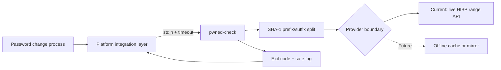

# Development and Architecture Principles

This document records the design principles, long-term intentions, and controls for `pwned-check`.

## Product Intent

`pwned-check` helps operating-system password-change processes reject passwords that appear in the Have I Been Pwned Pwned Passwords corpus.

The checker should remain small, auditable, and easy to invoke from platform-specific integration layers. Linux is the first integration target. macOS and Windows are deferred until signing, notarization, Authenticode, and native hook concerns can be addressed without lowering security posture.

## Core Design Principles

### Simple Boundary

The stable integration boundary is:

```text
candidate password over stdin -> pwned-check --stdin -> exit code
```

Count-based deployments may add the documented checker flag `--min-count <n>`. The default threshold is `1`, preserving any-hit rejection.

The checker should not expose a long-running daemon API unless there is a proven operational need. A short-lived process with a clear timeout is easier to reason about in password-change flows.

### Native, Small, and Deployable

The implementation is Go to produce native binaries with no Python runtime dependency. The long-term deployment artifact should be a small executable that can be signed, checksummed, audited, and invoked by PAM or native platform shims.

### No Password Disclosure

The plaintext password must never be logged, printed, written to disk, embedded in command arguments, or included in telemetry. The only external lookup material sent to a provider is the first five characters of the SHA-1 hash prefix.

### Provider Boundary

Production checks in the current phase use the live HIBP Pwned Passwords range API. The checker should keep a narrow provider boundary so a future offline cache or mirror provider can be added without changing the stdin-based checker integration contract. Test code may use mocked HIBP-compatible range responses.

### Fail Predictably

Failure behavior must be explicit:
- Fail-open protects availability.
- Fail-closed protects enforcement.

Both modes must be configurable, documented, and tested. Network timeouts must be hard limits, not best-effort hints.

### Thin Platform Integrations

Platform-specific integrations should be thin. They should collect the candidate password from the OS-supported password-change mechanism, invoke `pwned-check --stdin` with any documented policy flags and a strict timeout, and map exit codes to allow or reject.

Business logic belongs in the checker binary, not in PAM glue, macOS integration glue, or Windows Password Filter DLL code.

## Architecture



## Exit-Code Contract

- `0`: password accepted, or provider failure when fail-open is configured.
- `1`: password found in the breach corpus at or above the configured threshold and should be rejected.
- `2`: usage or configuration error.
- `3`: provider/network error when fail-closed is configured.

This contract is intentionally small. Changes to it should be treated as architecture decisions and documented before implementation.

The project may change the contract before `v1.0.0` while the concept is still being shaped. At `v1.0.0`, the stdin input model, exit-code meanings, and safe log event shape should be treated as stable unless a future major version explicitly changes them.

## Controls

### Security Controls

- Do not log plaintext passwords.
- Do not pass passwords through command-line arguments.
- Do not persist passwords in temporary files.
- Use HIBP k-anonymity range queries.
- Use strict provider and integration timeouts.
- Make fail-open/fail-closed behavior explicit for live provider failures.
- Keep provider-specific behavior behind the provider boundary.
- Keep platform integration layers minimal and auditable.

### Development Controls

- Keep public behavior covered by tests.
- Use mocked HIBP-compatible responses in CI.
- Keep live API dependency out of automated tests.
- Run `go test ./...`, `go vet ./...`, build, and binary smoke tests before release.
- Update docs when contract, configuration, or operational behavior changes.
- Keep result and provider-failure logs in a stable `event=<name> key=value` shape, including the safe `min_count` field on validation events.

### Release Controls

- Publish checksummed binaries.
- Keep release artifacts per OS/architecture.
- Document build provenance and dependency state.
- Add signing before macOS or Windows production-shaped distribution.

## Long-Term Design Intention

The intended end state is:

- A stable Go checker binary.
- Linux PAM integrations, including the helper path and optional native PAM module, that call the checker with a hard timeout.
- Live HIBP range API checks with explicit fail-open/fail-closed policy.
- A provider boundary that can support offline cache or mirror work later.
- Release artifacts with checksums and deployment guidance.
- Later macOS and Windows integration layers that reuse the same checker contract without reducing host security settings.

## Non-Goals For The Current Phase

- No macOS password integration until signing and notarization are planned.
- No Windows Password Filter DLL until Authenticode signing and LSASS safety considerations are planned.
- No long-running service unless CLI process startup becomes a measured blocker.
- No backwards-compatibility guarantee while the concept is still being shaped.
