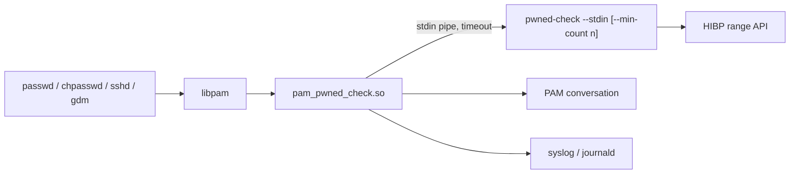

# Native PAM Module

This document defines the current contract for `pam_pwned_check.so`, the native
Linux PAM module shipped by the distro packages. Operator installation steps
live in [Linux install](linux-install.md); release and repository procedures
live in [Release playbook](release-playbook.md) and
[Package repositories](package-repositories.md).

The implementation is a Rust `cdylib` under `native/pam-pwned-check`.
Provider logic stays in the `pwned-check` checker process and is reached only
through the shared [Checker contract](checker-contract.md).

## Architecture



The Rust crate is split by responsibility: `config.rs` parses PAM arguments,
`checker.rs` owns checker execution, `events.rs` formats decisions and log
events, `pam_ffi.rs` owns PAM/libc FFI, and `lib.rs` remains the public surface
plus unit-test host.

## Scope

The module is a password-change screening component. It implements
`pam_sm_chauthtok`, retrieves or obtains `PAM_AUTHTOK`, invokes
`pwned-check --stdin`, supports fail-open/fail-closed, dry-run, timeout, debug,
and `min_count`, and ships through Debian/Ubuntu, Fedora/Rocky, Arch, and
Alpine packages.

It does not authenticate users, estimate password strength, enforce password
history, cache provider results, contact HIBP directly, run as a daemon, or
support non-Linux PAM implementations.

## Security Rules

The module runs inside privileged PAM-using processes, so it keeps a deliberately
small runtime surface:

- non-password PAM service functions return `PAM_IGNORE`
- Rust uses `panic = "abort"` and must never unwind across PAM or libc
  boundaries
- candidate material is copied only into module-owned zeroizing memory
- PAM-owned token memory is never modified
- candidate material is never logged, printed, put in argv, or put in
  environment
- provider HTTP and parsing logic stays out of the PAM process
- checker child processes receive a clean, explicit environment
- inherited file descriptors are closed with `close_range(2)` where available
  and an fd-walk fallback elsewhere
- checker stderr diagnostics are captured through a bounded pipe, not through
  `/tmp`
- the module does not call `setuid`, `setgid`, register signal handlers, or
  retry failed checker calls

The release dependency allowlist for `pam_pwned_check.so` is intentionally small:
platform PAM and C/runtime libraries such as `libpam`, `libc` or musl,
`libgcc_s`, `libdl`, `libpthread`, `libm`, and target PAM runtime dependencies
such as `libaudit`, `libcap-ng`, or Fedora's `libeconf`. Dependency checks fail
on unexpected additions.

## PAM Contract

| Function | Behavior |
|---|---|
| `pam_sm_chauthtok` with `PAM_PRELIM_CHECK` | Return `PAM_SUCCESS`; the candidate is not available yet. |
| `pam_sm_chauthtok` with `PAM_UPDATE_AUTHTOK` | Retrieve candidate, run checker, map result. |
| `pam_sm_authenticate` | Return `PAM_IGNORE`. |
| `pam_sm_setcred` | Return `PAM_IGNORE`. |
| `pam_sm_acct_mgmt` | Return `PAM_IGNORE`. |
| `pam_sm_open_session` | Return `PAM_IGNORE`. |
| `pam_sm_close_session` | Return `PAM_IGNORE`. |

The module reads `PAM_AUTHTOK` with `pam_get_item`. If no token is present
during `PAM_UPDATE_AUTHTOK`, it calls `pam_get_authtok` so it can work without a
separate quality module pre-populating the token. It never calls
`pam_set_item(PAM_AUTHTOK, ...)`, so downstream modules using `use_authtok` see
the original candidate.

### Return Mapping

The checker exit-code meanings are canonical only in
[Checker contract](checker-contract.md). The native module maps those outcomes
to PAM like this:

| Checker outcome | PAM return | Meaning |
|---|---|---|
| Accepted | `PAM_SUCCESS` | This module has no objection; the stack continues. |
| Pwned at or above threshold | `PAM_AUTHTOK_ERR` | Reject and show the pwned-password message. |
| Checker configuration error | `PAM_AUTHTOK_ERR` | Reject and log misconfiguration. |
| Provider-availability failure in fail-open mode | `PAM_SUCCESS` | Allow and log provider failure. |
| Provider-availability failure in fail-closed mode | `PAM_AUTHTOK_ERR` | Reject and log provider failure. |
| Timeout in fail-open mode | `PAM_SUCCESS` | Allow and log timeout. |
| Timeout in fail-closed mode | `PAM_AUTHTOK_ERR` | Reject and log timeout. |
| Exec failure | `PAM_AUTHTOK_ERR` | Reject and log exec failure. |
| Unexpected checker exit | `PAM_AUTHTOK_ERR` | Reject and log the exit code. |

Fail-open and fail-closed are provider-availability policies. They cover the
cases where the provider cannot return a breach count, including explicit
provider failure and module-level timeout while waiting for the checker. They do
not make local installation defects permissive: invalid module arguments,
missing checker binaries, and unexpected checker exits reject in both modes.

`PAM_SUCCESS` from `pam_pwned_check.so` does not mean the system accepts the
password. It means only that this module allows later PAM `password` modules to
continue.

Dry-run mode logs would-be rejections and returns `PAM_SUCCESS` for runtime
checker outcomes. Module configuration errors remain visible and conservative.

## Stack Placement

`pam_pwned_check.so` should run early in the `password` stack, before expensive
or state-changing modules such as password hashing, history checks, and account
backend updates. The recommended control is `requisite`, so a pwned-password
rejection stops the password-change flow immediately.

Length, dictionary, complexity, history, storage, and account policy remain the
responsibility of existing PAM modules such as `pam_pwquality`, `pam_passwdqc`,
`pam_pwhistory`, `pam_unix`, or site-specific account backends.

Example Debian/Ubuntu shape:

```text
password    requisite                       pam_pwned_check.so checker=/usr/bin/pwned-check timeout=3 fail_open
password    requisite                       pam_pwquality.so retry=3
password    required                        pam_pwhistory.so remember=5 use_authtok
password    [success=1 default=ignore]      pam_unix.so obscure use_authtok try_first_pass yescrypt
password    requisite                       pam_deny.so
password    required                        pam_permit.so
```

The module also works in simpler stacks without `pam_pwquality`; in that case it
obtains the candidate through `pam_get_authtok` and leaves the token available
for later modules.

## Arguments

Arguments are root-controlled PAM stack configuration and must never contain
secrets.

| Argument | Default | Meaning |
|---|---|---|
| `checker=<path>` | `/usr/local/bin/pwned-check` | Checker binary path. |
| `timeout=<seconds>` | `3` | Whole-second checker timeout. |
| `fail_open` | unset | Configure provider-availability failures to allow. |
| `fail_closed` | unset | Configure provider-availability failures to reject. |
| `dry_run` | unset | Log would-be decisions and allow runtime outcomes. |
| `debug` | unset | Emit extra safe configuration logs. |
| `min_count=<n>` | unset | Pass `--min-count <n>` to the checker; `n >= 1`. |

Unknown arguments and conflicting `fail_open`/`fail_closed` settings are
configuration errors. `min_count` is enforced by the checker contract, not by
parsing checker logs. If fail-open short-circuits a provider-availability
failure, the module sees the accepted checker outcome and lets the stack
continue.

Operators should select fail-open or fail-closed through the packaged enable
commands, for example `pwned-check-pam-enable-enforce --fail-closed`, rather
than editing PAM files directly.

## Checker Execution

The module invokes:

```text
pwned-check --stdin
```

With `min_count=<n>`:

```text
pwned-check --stdin --min-count <n>
```

The candidate is supplied only over stdin. Provider-availability policy is
passed explicitly with `PWNED_CHECK_FAIL_CLOSED=true` or
`PWNED_CHECK_FAIL_CLOSED=false`; inherited process environment is cleared.

Execution flow:

1. Create stdin and bounded stderr pipes.
2. Spawn the checker with stdout redirected to `/dev/null`.
3. In the child, start a new process group and close inherited fds.
4. In the parent, write the candidate to stdin and close the pipe.
5. Wait with a hard timeout.
6. On timeout, send `SIGTERM`, wait briefly, then send `SIGKILL`.
7. Map the checker outcome to the PAM contract and emit safe events.

Checker launches are serialized inside one PAM process. This keeps the bounded
stderr pipe from being inherited by another concurrent checker child between
pipe creation and `exec`. A contended caller can wait for the active checker
run to finish, up to one configured module timeout interval plus the short
termination grace period.

## Conversation Messages

The pwned-password message is fixed:

```text
This password appears in a known breach corpus. Choose a different password.
```

Provider, configuration, timeout, and exec failures use this message when they
reject:

```text
Password breach check failed. Try again later or contact your administrator.
```

Dry-run mode does not show rejection messages.

## Logging

Logs follow [Logging policy](logging-policy.md). They use the stable syslog
identifier `pwned-check` and low-cardinality fields.

| Event | Meaning |
|---|---|
| `pam_module_result` | Final allow, reject, or dry-run result. |
| `pam_module_failure` | Configuration, exec, timeout, provider, or checker failure. |
| `pam_module_config` | Debug-only safe configuration summary. |

Examples:

```text
event=pam_module_result result=allow
event=pam_module_result result=reject reason=pwned
event=pam_module_result result=allow mode=dry_run would=reject reason=pwned
event=pam_module_failure reason=timeout timeout=3s
event=pam_module_failure reason=checker_provider code=3
event=pam_module_failure reason=checker_exit code=9
```

The module must never log the candidate password, full SHA-1 hash, hash suffix,
provider response body, or high-cardinality user identifiers.

## Package Shape

Package installation places files on disk only. Enabling the module is an
explicit operator action and starts in dry-run mode.

| Family | Module path |
|---|---|
| Debian/Ubuntu | `/lib/$DEB_HOST_MULTIARCH/security/pam_pwned_check.so` |
| Fedora/Rocky | `/lib64/security/pam_pwned_check.so` |
| Arch Linux | `/usr/lib/security/pam_pwned_check.so` |
| Alpine Linux-PAM | `/usr/lib/security/pam_pwned_check.so` |

Packages include:

- `pam_pwned_check.so`
- `pwned-check`
- operator docs under `/usr/share/doc/pwned-check/`
- enable, enforce, disable, and rollback helpers
- Debian `pam-auth-update`, Fedora/Rocky `authselect`, or service-file wrapper
  integration

## Testing

Automated tests must not depend on the live HIBP API. Coverage includes Rust
unit tests, host PAM harness tests, package smokes, no-secret-output checks,
dependency allowlist and exported-symbol checks, and Valgrind-backed native argv
parser memory checks on Linux CI.

The current VM, Docker, architecture, and release-gate matrix is documented in
[Testing](testing.md) and [Distro testing](distro-testing.md).
