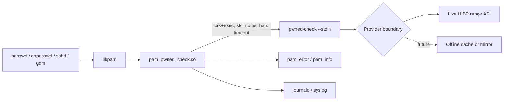

# Native PAM Module

This document describes the design and contract for a native Linux PAM module, `pam_pwned_check.so`, that performs the same any-hit rejection check as the current `pam_exec`-based integration.

Implementation has started with a Rust `cdylib` under `native/pam-pwned-check`. The current crate establishes exported PAM service symbols, argument parsing, safe conversation-message constants, `PAM_AUTHTOK` retrieval, checker invocation with a hard timeout, clean checker environment handling, child file-descriptor cleanup, checker-outcome mapping, structured syslog emission, Linux shared-library dependency inspection, Debian/Ubuntu native packaging, distro package smoke tests, and Ubuntu AppArmor/lockout hardening assessment coverage. The persistent Ubuntu smoke harness exercises the in-development module through `pam_chauthtok`.

The native module is an additional supported Linux integration path. It does not replace the current `pam_exec.so` plus `pwned-check-pam-helper` flow. Both paths should remain valid so operators can choose based on distro packaging, audit requirements, rollout risk, and recovery constraints.

## Architecture



The module is the only new runtime component in the first release. The checker, provider boundary, and exit-code contract remain unchanged.

## Intent

The native module exists to:

- integrate cleanly with distro PAM management tools such as `pam-auth-update` on Debian and Ubuntu, and `authselect` on Fedora and RHEL
- surface user-facing rejection messages through PAM conversation functions
- avoid `pam_exec.so expose_authtok` quirks in deployments that prefer a native PAM module
- provide the packaging shape that distro maintainers expect for a PAM integration
- create a future path for lower-overhead IPC if real deployments prove fork/exec cost matters

The native module does not exist to:

- move provider HTTP logic into privileged PAM-using processes
- replace the `pwned-check --stdin` checker contract
- ship a long-running daemon by default
- link the checker as an in-process library
- replace the helper-based integration before the native path has independent evidence and tests

## Scope

In scope for the first native module release:

- a Rust `cdylib` that builds `pam_pwned_check.so`
- meaningful implementation of `pam_sm_chauthtok` for password-change enforcement
- fork and exec of the existing `pwned-check --stdin` checker
- explicit timeout handling around the checker process
- explicit fail-open and fail-closed configuration passed to the checker
- dry-run mode for staged rollout
- structured syslog or journald-compatible events aligned with the current logging policy
- Debian and Fedora packaging plans with documented enablement through `pam-auth-update` and `authselect`
- unit, PAM-wrapper, and container integration tests for supported distro paths

Out of scope for the first native module release:

- replacing the existing `pam_exec` integration
- a long-running checker daemon
- an offline cache or mirror provider
- macOS or Windows native integrations
- linking provider logic or HTTP clients into the PAM process
- `min_count` or threshold-based rejection

## Design Principles

The native module inherits the project principles in [Development and Architecture Principles](development-architecture.md) and [Security Model](security-model.md). The principles below restate the ones that become sharper inside a shared object loaded by privileged processes.

### Smallest Possible Surface

The module implements only password-change behavior. `pam_sm_chauthtok` is the only service function with meaningful policy logic.

All other PAM service functions return `PAM_IGNORE` so the module is inert outside the password-change path:

- `pam_sm_authenticate`
- `pam_sm_setcred`
- `pam_sm_acct_mgmt`
- `pam_sm_open_session`
- `pam_sm_close_session`

### No Provider Logic In Process

The module never opens a network socket and never embeds provider lookup behavior.

Provider checks remain inside the existing `pwned-check` binary, invoked with `--stdin`. The live HIBP range API, provider timeout, fail-open and fail-closed policy, mocked test providers, and future provider extensions stay behind the checker boundary.

### Stable Checker Contract

The module is a caller of `pwned-check --stdin`.

It does not reach into checker internals. It does not depend on undocumented output. It may include a bounded diagnostic excerpt from checker stderr in module logs, but the module must not parse checker stderr for policy decisions.

If the checker contract changes, the module can change to match it. The native module must not force checker contract changes merely to satisfy PAM implementation details.

### Rust FFI Discipline

The module should be implemented in Rust because it provides a better safety profile than C while still producing a native PAM-loadable shared object.

C remains an acceptable fallback if Rust packaging into target distributions becomes a blocker. Go must not be used for the PAM module. The Go runtime's signal handling, scheduler, and memory model are not appropriate for a shared object loaded into `sshd`, `sudo`, `passwd`, `gdm`, and similar processes. Go remains the checker language.

The FFI boundary must stay narrow:

- build as a `cdylib`
- set `panic = "abort"`
- never unwind across PAM or libc boundaries
- avoid async runtimes inside the PAM module
- avoid global mutable state unless it is protected and justified
- keep argument parsing and exit-code mapping as testable pure logic where possible

### No Plaintext Disclosure

The candidate password is retrieved from `PAM_AUTHTOK`, copied into module-owned memory, written to the checker stdin pipe, and then cleared from the module-owned buffer as soon as the write is complete.

The module must not mutate or zero PAM-owned memory returned by `pam_get_item`.

The password must not appear in:

- module logs
- module argv
- checker argv
- environment variables passed to the checker
- syslog or journald fields
- audit records
- core dumps
- panic messages
- test fixtures committed to the repository

### Core Dump Posture

The module should consider `PR_SET_DUMPABLE = 0` before handling candidate material, but this affects the whole host process, not only the module. That means the control must be implemented deliberately and documented as a process-wide side effect.

Before implementation, decide whether the module:

- sets dumpable to `0` and leaves it there
- stores and restores the previous value after candidate handling
- defers this control to a later hardening issue

The initial implementation must not present dump suppression as a harmless module-local setting.

### Privileged Process Controls

The module runs inside privileged PAM-using processes. It must keep its behavior smaller and stricter than an ordinary CLI program:

- do not call `setuid`, `setgid`, or otherwise change identity
- do not register signal handlers
- do not create threads
- do not retry the checker on failure
- close inherited file descriptors above stderr in the child before `execve`
- pass an explicit minimal environment to the checker
- avoid loading additional shared libraries beyond libpam, the platform C library, and libraries required by the Rust runtime/build target
- keep provider access out of the module process

Before implementation, the release must define an explicit allowlist of acceptable transitive shared-library dependencies for each target. The Linux Rust `cdylib` allowlist is expected to include only the platform's PAM and C/runtime dependencies such as `libpam`, `libc`, `libc.musl-*`, `libgcc_s`, `libdl`, `libpthread`, and `libm`, plus target PAM runtime dependencies such as `libaudit`, `libcap-ng`, and Fedora's `libeconf`, adjusted for the target libc and linker behavior. CI must run an equivalent of `ldd pam_pwned_check.so` or the distro-appropriate dynamic dependency inspection tool and fail on unexpected additions.

If the module implements dump suppression, it must call `prctl(PR_SET_DUMPABLE, 0)` while candidate material is in module-owned memory and restore the prior value before returning, unless a later design decision documents why leaving dumpability disabled is safer for host processes.

### Fail Predictably

The module must make failure behavior explicit.

The module should pass fail-open or fail-closed configuration to the checker rather than trying to infer provider failure from checker logs. If the checker returns success, the module treats it as success. If provider failure should reject, the checker must be invoked in fail-closed mode so it returns the documented provider error exit.

Configuration errors, timeouts, exec failures, and unexpected checker exits are conservative rejections outside dry-run mode.

### Lockout Safety

A misconfigured module must be recoverable.

The module should avoid `PAM_ABORT` for ordinary configuration, provider, timeout, or checker failures. Recommended stack placement must keep `pam_rootok.so`, single-user recovery, and documented rescue paths unaffected.

Dry-run mode must be available before production enforcement so operators can observe would-be decisions without risking lockout.

## Module Contract

### Service Functions

| Function | Behavior |
|---|---|
| `pam_sm_chauthtok` with `PAM_PRELIM_CHECK` | Return `PAM_SUCCESS` without touching `PAM_AUTHTOK`. The candidate is not yet available. |
| `pam_sm_chauthtok` with `PAM_UPDATE_AUTHTOK` | Retrieve `PAM_AUTHTOK`, invoke checker, map result. |
| `pam_sm_authenticate` | Return `PAM_IGNORE`. |
| `pam_sm_setcred` | Return `PAM_IGNORE`. |
| `pam_sm_acct_mgmt` | Return `PAM_IGNORE`. |
| `pam_sm_open_session` | Return `PAM_IGNORE`. |
| `pam_sm_close_session` | Return `PAM_IGNORE`. |

The module reads `PAM_AUTHTOK` with `pam_get_item` and never modifies it. Downstream modules using `use_authtok` must see the same value the user supplied.

### Return-Code Mapping

| Checker outcome | Module return | Meaning |
|---|---|---|
| `0` clean | `PAM_SUCCESS` | The module has no objection. The stack continues. |
| `0` provider failure in checker fail-open mode | `PAM_SUCCESS` | The module has no objection because deployment policy is fail-open. The stack continues. |
| `1` pwned | `PAM_AUTHTOK_ERR` | Password rejected. User-facing message is sent through PAM conversation. |
| `2` configuration error | `PAM_AUTHTOK_ERR` | Conservative rejection. Logged as misconfiguration. |
| `3` provider failure in checker fail-closed mode | `PAM_AUTHTOK_ERR` | Conservative rejection. Logged as provider failure. |
| Timeout | `PAM_AUTHTOK_ERR` | Conservative rejection. Logged as timeout. |
| Exec failure | `PAM_AUTHTOK_ERR` | Conservative rejection. Logged as exec failure. |
| Unexpected checker exit | `PAM_AUTHTOK_ERR` | Conservative rejection. Logged with the checker exit code. |

This matches the existing PAM helper posture: config failures, provider failures in fail-closed mode, timeouts, exec failures, and unexpected exits reject rather than silently allowing a password change.

`PAM_SUCCESS` from this module does not mean the password is accepted by the system. It means only that `pam_pwned_check.so` has no objection and the rest of the PAM `password` stack should continue. Length, complexity, history, account state, and final password storage remain the responsibility of downstream modules.

## Stack Placement And Composition

The module is a screening module. It performs one check, HIBP corpus membership, and defers every other password policy concern to other PAM modules in the same stack.

The responsibility boundaries below are recommendations for a simple, composable deployment. Some sites legitimately consolidate complexity, history, and storage policy into a custom module; `pam_pwned_check.so` should still remain focused on breach-corpus screening.

| Concern | Recommended owner |
|---|---|
| HIBP corpus membership | `pam_pwned_check.so` |
| Length, complexity, dictionary checks, and character-class policy | `pam_pwquality`, `pam_passwdqc`, or site policy module |
| Password history | `pam_pwhistory` or site policy module |
| Password hashing and `/etc/shadow` updates | `pam_unix` or distro/account backend |
| Account state and authentication policy | Existing account/auth PAM modules |

### Composition Contract

The module honors this contract so it can compose with other PAM `password` modules:

- read `PAM_AUTHTOK` with `pam_get_item` and never modify it
- never call `pam_set_item(PAM_AUTHTOK, ...)`, `pam_set_item(PAM_OLDAUTHTOK, ...)`, or any other PAM item-setting function
- never prompt the user directly
- return `PAM_SUCCESS` to mean "this module has no objection," not "the password is accepted"
- return `PAM_AUTHTOK_ERR` only for documented rejection reasons
- avoid `PAM_ABORT`, `PAM_USER_UNKNOWN`, and other return codes outside the mapping table
- behave the same regardless of whether it is placed before or after `pam_pwquality`, `pam_pwhistory`, `pam_passwdqc`, `pam_unix`, or other password modules

If `PAM_AUTHTOK` is absent during `PAM_UPDATE_AUTHTOK`, the module returns `PAM_AUTHTOK_ERR` and lets the surrounding stack control the user-facing retry behavior.

The module intentionally does not pre-fetch HIBP results during `PAM_PRELIM_CHECK`. That keeps the module stateless across PAM phases and avoids caching candidate-derived material inside the host process.

### Recommended Placement

The module should run early in the `password` stack, before modules that perform expensive work such as hashing, file writes, history comparisons, and dictionary scoring. Rejecting a pwned candidate before `pam_unix` hashes it avoids unnecessary work and avoids touching `/etc/shadow` for a doomed attempt.

The recommended control is `requisite`:

- success continues to later password modules
- failure stops immediately and returns failure to the application

`required` is less suitable for this screening use case because the stack continues after a pwned-password rejection and may ask the user to satisfy quality or history rules for a password that cannot be accepted. `requisite` gives clearer feedback and avoids unnecessary downstream work.

### Debian And Ubuntu Example

The `pam-auth-update` profile shipped by the package should place the module at the top of the `Password` block. A resulting `/etc/pam.d/common-password` stack may look like:

```text
password    requisite                       pam_pwned_check.so
password    requisite                       pam_pwquality.so retry=3
password    required                        pam_pwhistory.so remember=5 use_authtok
password    [success=1 default=ignore]      pam_unix.so obscure use_authtok try_first_pass yescrypt
password    requisite                       pam_deny.so
password    required                        pam_permit.so
```

In this stack, `pam_pwned_check.so` rejects known-pwned candidates first. Clean candidates continue to quality, history, and storage modules. Later modules using `use_authtok` see the original candidate because the module does not modify `PAM_AUTHTOK`.

The example uses `yescrypt`, which is the Debian 12 and Ubuntu 24.04-era default. Older support targets such as Debian 11 may use `sha512`; package examples should match the oldest supported distro in the release support matrix.

Fedora and RHEL stacks have the same shape with different module arguments and distro-managed placement through `authselect`. The default quality module is usually `pam_pwquality`; hardened deployments may use `pam_passwdqc` or a custom policy module instead.

This design is Linux PAM-specific. Solaris, FreeBSD/OpenPAM, macOS PAM/OpenPAM, and other PAM-like systems have different packaging and control-syntax details. They are outside the first native module support matrix.

### Module Arguments

Arguments are parsed from `argv` in the PAM stack line. They are root-controlled configuration and must never contain secrets.

| Argument | Default | Meaning |
|---|---|---|
| `checker=<path>` | `/usr/local/bin/pwned-check` | Path to the `pwned-check` binary. |
| `timeout=<seconds>` | `3` | Hard timeout for the checker process. |
| `fail_open` | unset | Configure checker provider failures to allow the password change. |
| `fail_closed` | unset | Configure checker provider failures to reject the password change. |
| `dry_run` | unset | Run the checker, log the would-be outcome, and always return `PAM_SUCCESS` unless the module cannot parse its own configuration. |
| `debug` | unset | Emit additional structured logs. Never log candidate material. |

If neither `fail_open` nor `fail_closed` is set, the module should use the checker's default provider-failure behavior and log that the policy was inherited.

If both `fail_open` and `fail_closed` are set, the module must treat the configuration as invalid.

Unknown arguments must be treated as configuration errors. A typo such as `fail_clsoed` must not silently change security posture. In enforcement mode, invalid module configuration returns `PAM_AUTHTOK_ERR`; in dry-run mode, invalid runtime outcomes may allow, but invalid module configuration should still be visible and fail closed unless a later decision explicitly changes this.

Future arguments may include `min_count=<n>` once the checker supports structured count-based policy decisions. The current checker exit-code contract is any-hit only, so count-based policy requires a checker contract change before the module can enforce it. The first native release remains any-hit rejection only.

### Checker Invocation

The module invokes:

```text
pwned-check --stdin
```

The candidate is supplied only over stdin. The checker path, timeout, and fail policy are configuration values and may appear in module argv or environment.

The module should pass fail policy to the checker explicitly, for example with `PWNED_CHECK_FAIL_CLOSED=true` or `PWNED_CHECK_FAIL_CLOSED=false`, rather than relying on inherited process environment.

The checker stderr may be captured for bounded diagnostics, following the existing helper pattern. The diagnostic excerpt must be length-limited and must not influence policy decisions.

### Fork And Exec Flow

The first release uses fork and exec:

1. The module creates pipes for checker stdin and stderr.
2. The module sets close-on-exec on file descriptors that should not survive into the child.
3. The module forks.
4. The child connects the stdin pipe read end to stdin, redirects stdout to `/dev/null`, connects stderr to the bounded capture pipe, closes inherited file descriptors above stderr, and calls `execve` with the configured checker and `--stdin`.
5. The child receives a clean environment containing only documented checker/provider variables.
6. The parent writes the candidate to the checker stdin pipe, closes the write end, and clears its module-owned candidate buffer.
7. The parent waits with a hard timeout.
8. On timeout, the parent sends `SIGTERM`, waits a short grace period, then sends `SIGKILL` if the checker has not exited.
9. The parent reads the checker exit status, maps it to a PAM return value, and emits a safe event.

A long-running daemon over a Unix socket remains a future option. Adding that IPC path must not change the module argument contract or the user-facing message contract.

### Conversation Messages

On pwned-password rejection, the module sends a fixed, bounded `PAM_ERROR_MSG` through the PAM conversation function:

```text
This password appears in a known breach corpus. Choose a different password.
```

Provider, config, timeout, and exec failures may use a different fixed message:

```text
Password breach check failed. Try again later or contact your administrator.
```

Dry-run mode must not show rejection messages to the user.

## Logging

The module should log structured events consistent with [Logging policy](logging-policy.md). Logs must use low-cardinality fields and must not include plaintext passwords, usernames unless explicitly justified, full hashes, hash suffixes, or provider response bodies.

Module-specific event names:

| Event | Meaning |
|---|---|
| `pam_module_result` | Final allow, reject, or dry-run outcome. |
| `pam_module_failure` | Module configuration, exec, timeout, provider, or unexpected checker failure. |
| `pam_module_config` | Optional debug-only configuration summary with no secrets. |

Example lines:

```text
event=pam_module_result result=allow
event=pam_module_result result=reject reason=pwned
event=pam_module_result result=allow mode=dry_run would=reject reason=pwned
event=pam_module_failure reason=timeout timeout=3s
event=pam_module_failure reason=checker_config code=2
event=pam_module_failure reason=checker_provider code=3
event=pam_module_failure reason=checker_exit code=9
event=pam_module_failure reason=exec error="permission denied"
```

Logs use syslog with the stable identifier `pwned-check` so operators can query with tools like:

```bash
journalctl -t pwned-check
```

The module must never log:

- the candidate password
- the full SHA-1 hash or suffix
- provider response bodies
- user account names as primary identifiers

`PAM_USER` may be included only when debug logging is explicitly enabled, and only as a non-sensitive correlation field on a separate low-cardinality event.

## Packaging Plan

The native module packaging plan should be implemented after the module contract and tests exist.

Expected file placement:

| Platform family | Module path |
|---|---|
| Debian/Ubuntu | `/lib/$DEB_HOST_MULTIARCH/security/pam_pwned_check.so` |
| Fedora/RHEL | `/lib64/security/pam_pwned_check.so` |
| Arch Linux | `/usr/lib/security/pam_pwned_check.so` |
| Alpine Linux | `/lib/security/pam_pwned_check.so` for Alpine Linux-PAM |

Expected package contents:

- `pam_pwned_check.so`
- `pwned-check`
- documentation under `/usr/share/doc/pwned-check/`
- Debian `pam-auth-update` profile under `/usr/share/pam-configs/pwned-check`
- Fedora/RHEL `authselect` feature plan or package-specific enablement notes
- Arch Linux package or generic-tarball enablement notes
- Alpine Linux package or generic-tarball enablement notes for Linux-PAM deployments
- rollback and emergency recovery instructions

Packaging order:

1. Debian/Ubuntu package with `pam-auth-update` integration.
2. Fedora/RHEL package with `authselect` integration and SELinux assessment.
3. Arch Linux package or generic tarball path with explicit PAM edit/restore workflow.
4. Alpine Linux package or generic tarball path after Linux-PAM path validation.

### Remaining Delivery Sequence

Epic 6 should finish in the order below. The order is intentional: platform hardening comes before production package formats, package formats come before CI/release gates, and release gates come before operator-facing release readiness.

| Story ID | Story | Depends on | Exit criteria |
|---|---|---|---|
| [EP6-S1](https://github.com/phillipmcmahon/pwned-check/issues/15) | Fedora/RHEL SELinux assessment and policy decision | Current Fedora host smoke | `make native-pam-fedora-selinux-assessment` passes in enforcing mode or records a bounded exception, AVCs are captured, and the project records whether policy ships in-tree, separately, or as operator-managed docs |
| [EP6-S2](https://github.com/phillipmcmahon/pwned-check/issues/16) | RPM-native package delivery | EP6-S1 | `make package-native-pam-rpm` builds a native RPM, and `make native-pam-fedora-rpm-package-smoke` verifies package install, installed-file PAM behavior, authselect rollback, removal, and managed-file cleanup |
| [EP6-S3](https://github.com/phillipmcmahon/pwned-check/issues/17) | Debian/Ubuntu `.deb` package delivery | Current Ubuntu host smoke | `make package-native-pam-debian` builds a native `.deb`, and `make native-pam-ubuntu-deb-package-smoke` verifies package install, installed-file PAM behavior, `pam-auth-update` enable/disable, `common-password` restoration, removal, and managed-file cleanup |
| [EP6-S4](https://github.com/phillipmcmahon/pwned-check/issues/18) | Arch `PKGBUILD` package delivery | Current Arch Docker generic package smoke | `make package-native-pam-arch` builds a pacman package from `packaging/arch/PKGBUILD.in`, and `make native-pam-arch-package-smoke` verifies package install, installed-file PAM behavior, manual rollback, removal, and managed-file cleanup |
| [EP6-S5](https://github.com/phillipmcmahon/pwned-check/issues/19) | Alpine `APKBUILD` package delivery | Current Alpine VM and Docker generic package smoke | `make package-native-pam-alpine` builds an Alpine package from `packaging/alpine/APKBUILD.in`, and `make native-pam-alpine-package-smoke` verifies package install, installed-file PAM behavior, manual rollback, removal, and managed-file cleanup |
| [EP6-S6](https://github.com/phillipmcmahon/pwned-check/issues/20) | CI distro and dependency gates | EP6-S2 through EP6-S5 package paths | `Native PAM Package Gates` runs Docker-capable package gates and Ubuntu `.deb` smoke in GitHub Actions; Fedora RPM/SELinux and persistent VM gates are documented release gates |
| [EP6-S7](https://github.com/phillipmcmahon/pwned-check/issues/21) | Native PAM release provenance | EP6-S6 | Signed package artifacts, provenance attestations, pinned toolchains, deterministic build settings, and dependency reports are produced for release candidates |
| [EP6-S8](https://github.com/phillipmcmahon/pwned-check/issues/22) | Operator rollout and recovery release docs | EP6-S7 | Install, dry-run, enforcement, rollback, rescue, and emergency recovery docs are package-specific and validated against the test runbook |
| [EP6-S9](https://github.com/phillipmcmahon/pwned-check/issues/23) | Final native PAM hardening closeout | EP6-S8 | Remaining fuzzing, sanitizer or memory-check, no-secret-output, lockout-safety, SELinux/AppArmor, and open-question decisions are complete or explicitly deferred |

Board stories should use these IDs in their titles or descriptions so commits and validation notes can be tied back to this sequence.

Tracked distro delivery matrix:

| Distro family | Package shape | Enable path | Rollback path | Automated coverage |
|---|---|---|---|---|
| Debian/Ubuntu | Native filesystem-layout artifact plus native `pwned-check-native-pam` `.deb` | `pam-auth-update --enable pwned-check --package` | `pam-auth-update --disable pwned-check --package` plus package removal | Persistent Ubuntu smoke installs the artifact and verifies enable/disable rollback; distro smoke builds and loads the module directly; `.deb` smoke validates package install, profile enable/disable, removal, and managed-file cleanup |
| Fedora/RHEL/Rocky | RPM-family filesystem-layout artifact plus native `pwned-check-native-pam` RPM | Authselect helper creates and selects `custom/pwned-check` in dry-run mode | Restore the authselect backup recorded during enablement, then remove the RPM when uninstalling | Distro smoke builds and loads the module directly; host smoke validates filesystem-layout behavior; RPM smoke validates package install, authselect enable/rollback, removal, and managed-file cleanup; SELinux assessment passes on Fedora 44 enforcing mode |
| Arch Linux | Generic filesystem-layout artifact plus native pacman package from `PKGBUILD` | Manual PAM helper edits the target service in dry-run mode | Restore the timestamped PAM service backup recorded during enablement, then remove the package when uninstalling | Distro smoke builds and loads the module directly; generic package smoke installs, enables, exercises, and rolls back on Arch; Arch package smoke validates pacman install/removal and managed-file cleanup |
| Alpine Linux | Generic filesystem-layout artifact plus native APK package from `APKBUILD` after Linux-PAM path validation | Manual PAM helper edits the target service in dry-run mode | Restore the timestamped PAM service backup recorded during enablement, then remove the package when uninstalling | Distro smoke builds and loads the module directly; generic package smoke installs, enables, exercises, and rolls back on Alpine Linux-PAM; Alpine package smoke validates APK install/removal and managed-file cleanup |

### Debian And Ubuntu

Debian and Ubuntu packages should:

- install the module at `/lib/$DEB_HOST_MULTIARCH/security/pam_pwned_check.so`
- install a `pam-auth-update` profile at `/usr/share/pam-configs/pwned-check`
- call `pam-auth-update --package` from maintainer scripts only when this behavior is safe and documented
- support `amd64` and `arm64`
- build on the oldest supported Debian release in the support matrix to keep glibc requirements low
- test profile enablement and rollback in the Ubuntu persistent smoke container or host smoke path before release; Debian-specific coverage runs through the Debian Docker smoke route unless a dedicated Debian VM is added later

Build the native `.deb` package with:

```bash
make package-native-pam-debian
```

Validate package-manager behavior on an Ubuntu host with:

```bash
make native-pam-ubuntu-deb-package-smoke
```

The Debian package is named `pwned-check-native-pam`. Package installation places the module, checker, documentation, and `pam-auth-update` profile on disk, but does not enable the PAM module. Enablement remains an explicit operator action through `pam-auth-update --enable pwned-check --package`, and the smoke verifies that disablement restores `/etc/pam.d/common-password`.

### Fedora And RHEL

Fedora and RHEL packages should:

- install the module at `/lib64/security/pam_pwned_check.so`
- install authselect enable and rollback helpers under `/usr/share/pwned-check/authselect/`
- create a custom authselect profile from the current profile during explicit enablement, not during package installation
- support `x86_64` and `aarch64`
- include a SELinux assessment before production release
- test rollback from the selected `authselect` workflow before release

Build the native RPM package with:

```bash
make package-native-pam-rpm
```

Validate package-manager behavior on a Fedora/RHEL-family host with:

```bash
make native-pam-fedora-rpm-package-smoke
```

The RPM package is named `pwned-check-native-pam`. Package installation places the module, checker, documentation, and authselect helpers on disk, but does not enable the PAM module. Enablement remains an explicit operator action through `/usr/share/pwned-check/authselect/enable-authselect.sh`, which inserts the module in `dry_run` mode and records an authselect backup for rollback.

SELinux assessment is tracked by [EP6-S1](https://github.com/phillipmcmahon/pwned-check/issues/15) and should be run with:

```bash
make native-pam-fedora-selinux-assessment
```

The assessment captures SELinux mode, authselect state, Fedora host package smoke output, audit AVCs, and a combined text report under `.test-output/native-pam-fedora-selinux-assessment/`. It fails if AVCs mention pwned-check, `pam_pwned_check`, or the Fedora host smoke service.

The first release decision is to avoid shipping an in-tree SELinux policy module unless the enforcing-mode assessment finds project-specific AVCs. The native PAM module itself should only fork/exec the checker and should not contact the provider directly. If a deployment's local SELinux policy blocks the checker network path from password-change domains, the release should document the operator-managed exception rather than silently broadening policy in the package. A dedicated policy package can be added later if repeated production evidence shows the same minimum rule set is required across Fedora/RHEL deployments.

### Arch Linux

Arch Linux packages should:

- install the module at `/lib/security/pam_pwned_check.so` for Alpine Linux-PAM
- install the checker at a stable executable path such as `/usr/bin/pwned-check`
- install manual PAM enable and rollback helpers under `/usr/share/pwned-check/manual-pam/`
- document the exact PAM password-stack edit or package-managed include file used to enable the module
- preserve a timestamped backup of any edited PAM file before enablement
- test rollback by restoring the backup, removing the module line, and verifying password changes still reach the normal stack

Build the Arch package with:

```bash
make package-native-pam-arch
```

Validate package-manager behavior through the Docker route with:

```bash
make native-pam-arch-package-smoke
```

The package is built from `packaging/arch/PKGBUILD.in` and is named `pwned-check-native-pam`. Package installation places files on disk only. Operators must run `/usr/share/pwned-check/manual-pam/enable-manual-pam.sh` explicitly to enable dry-run mode against the chosen PAM service.

### Alpine Linux

Alpine Linux packages should:

- validate the target Linux-PAM module directory before release because Alpine deployments can vary between minimal and Linux-PAM-enabled images
- install the checker at a stable executable path such as `/usr/bin/pwned-check`
- install manual PAM enable and rollback helpers under `/usr/share/pwned-check/manual-pam/`
- document that native PAM integration applies only to Linux-PAM deployments, not BusyBox-only authentication paths
- preserve a timestamped backup of any edited PAM file before enablement
- test rollback by restoring the backup, removing the module line, and verifying password changes still reach the normal stack

Build the Alpine package with:

```bash
make package-native-pam-alpine
```

Validate package-manager behavior through the Docker route with:

```bash
make native-pam-alpine-package-smoke
```

The package is built from `packaging/alpine/APKBUILD.in` and is named `pwned-check-native-pam`. Native PAM integration remains Linux-PAM-only; BusyBox-only authentication paths are outside this package's supported behavior. Package installation places files on disk only, and operators must run `/usr/share/pwned-check/manual-pam/enable-manual-pam.sh` explicitly to enable dry-run mode against the chosen PAM service.

### Signing And Provenance

Release packages should include:

- `.deb` signatures with the project release key
- `.rpm` signatures through `rpm --addsign`
- SLSA-style provenance attestations for both `pam_pwned_check.so` and the checker binary
- reproducible build controls, including pinned toolchains and `SOURCE_DATE_EPOCH` set from the release tag

Native package release candidates must also run:

```bash
make native-pam-release-provenance
```

This writes `native-pam-SHA256SUMS.txt` and `native-pam-provenance.json` next to the native PAM artifacts. If `PWNED_CHECK_RELEASE_SIGNING_KEY` is set, the script also creates detached armored GPG signatures for both files. Private signing keys must remain outside the repository and outside persistent test VMs.

## Testing Strategy

The native module must not rely on the live HIBP API in automated tests.

Required test layers:

- unit tests for argument parsing, checker outcome mapping, and event formatting
- equivalent host-level PAM harness tests for module loading and conversation behavior in CI, with `libpam_wrapper` still available as a future no-root refinement
- container integration tests that install the package and exercise real PAM stack behavior on supported distros
- fault injection for provider HTTP 5xx, provider timeout, checker missing, checker not executable, checker timeout, checker config failure, provider failure, malformed module args, SELinux enforcing, and AppArmor enforcing or captured host AppArmor state
- dry-run tests proving would-be rejections do not block password changes
- no-secret-output tests covering module logs, conversation messages, checker argv, and diagnostics
- fixture tests for the exact safe conversation strings documented in [Logging policy](logging-policy.md)
- CI dependency allowlist checks for `pam_pwned_check.so`, using `ldd` or the target distro's equivalent dynamic dependency inspection
- parser fuzzing for module argv handling
- sanitizer or memory-check test path for FFI seams where practical, including ASan and Valgrind where supported
- lockout-safety tests that intentionally misconfigure the module and assert documented root recovery paths still work

Current closeout status:

- unit, host harness, Docker distro, package, dependency allowlist, symbol, Ubuntu host, Fedora host, Fedora SELinux, Arch package, and Alpine package gates are in place
- native module argv fuzzing and sanitizer/memory-check coverage are tracked as [#24](https://github.com/phillipmcmahon/pwned-check/issues/24)
- Ubuntu/Debian AppArmor state capture and lockout recovery drills are covered by `make native-pam-ubuntu-hardening-assessment`
- count-based `min_count` policy is tracked as [#26](https://github.com/phillipmcmahon/pwned-check/issues/26) because it requires a checker contract change

The first-wave container test matrix is:

- Debian stable
- Ubuntu LTS
- Fedora current
- Rocky or another RHEL-compatible image with SELinux/authselect behavior addressed
- Arch Linux
- Alpine Linux with Linux-PAM installed

The existing Docker PAM smoke tests provide the starting point, but native module tests must load `pam_pwned_check.so` directly rather than testing through `pam_exec.so`.

Per-distro integration tests should install the package, enable the module through the distro's PAM management tool, attempt password changes with known-pwned and known-clean candidates, and assert both syslog content and password state. The tests must continue using the existing HIBP-compatible local provider.

The current Docker and persistent VM distro testing workflow is documented in [distro-testing.md](distro-testing.md).

## Rollout Posture

Operators should roll out the native module in phases:

1. Install package without enabling enforcement.
2. Enable dry-run mode.
3. Observe `event=pam_module_result mode=dry_run` events for a documented observation period.
4. Confirm emergency rollback and rescue access.
5. Disable dry-run and initially keep `fail_closed` unset unless the deployment already accepts provider-outage lockout risk.
6. Evaluate fail-closed after provider stability is understood in the deployment environment.
7. Document the chosen provider-failure posture.
8. Monitor logs after enforcement.

Documentation must put recovery instructions before advanced configuration. Native PAM modules run inside privileged authentication processes, so rollback needs to be obvious and tested.

Rollback documentation must cover:

- disabling the module through `pam-auth-update`
- disabling the module through `authselect`
- removing the package
- recovery from a misconfigured PAM stack through single-user mode or a rescue image

## Future IPC Option

A long-running checker daemon over a Unix socket remains a future option, not the first release path.

The daemon option may become attractive if measured fork/exec cost, DNS behavior, provider rate limiting, or offline-cache work justifies the operational cost of installing and supervising a service.

If added later, the module contract should remain stable. Only the internal IPC implementation should change.

## Closeout Decisions

The implementation sequence resolved the first-release questions as follows:

- User-facing native PAM conversation messages are fixed English-only for the first native package release. Localization can be added later without changing the checker contract.
- `min_count` remains reserved. The current checker contract is any-hit through exit code `1`; count-based policy requires a future checker contract change before module enforcement.
- SELinux policy is operator-managed documentation for the first release. Fedora 44 enforcing-mode assessment passed without project-specific AVCs, so the package should not ship a broad policy module by default.
- The module argv contract is stable for the documented first native package release options: `checker`, `timeout`, `fail_open`, `fail_closed`, `dry_run`, and `debug`. New policy arguments should be additive or gated behind a documented contract revision.

## Non-Goals

- The module does not perform password strength estimation.
- The module does not enforce password history.
- The module does not cache results.
- The module does not contact the provider directly.
- The module does not reduce the security posture of the host's PAM stack.
- The module does not replace the existing `pam_exec` integration.
