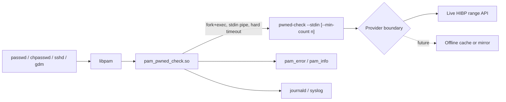

# Native PAM Module

This document describes the design and contract for a native Linux PAM module, `pam_pwned_check.so`, that performs the same default any-hit rejection check as the current `pam_exec`-based integration, with optional count-based thresholding through the shared checker contract.

The current implementation is a Rust `cdylib` under `native/pam-pwned-check`. The crate establishes exported PAM service symbols, argument parsing, safe conversation-message constants, `PAM_AUTHTOK` retrieval, checker invocation with a hard timeout, clean checker environment handling, child file-descriptor cleanup, checker-outcome mapping, structured syslog emission, Linux shared-library dependency inspection, Debian/Ubuntu native packaging, distro package smoke tests, and Ubuntu AppArmor/lockout hardening assessment coverage. The persistent Ubuntu smoke harness exercises the module through `pam_chauthtok`.

The Rust implementation is split into focused modules: `config.rs` owns module argument parsing, `checker.rs` owns checker fork/exec and timeout handling, `events.rs` owns decision mapping and structured log event formatting, `pam_ffi.rs` owns PAM symbols and libc/PAM FFI, and `lib.rs` remains the small public surface plus unit-test host.

The native module is an additional supported Linux integration path. It does not replace the current `pam_exec.so` plus `pwned-check-pam-helper` flow. Both paths should remain valid so operators can choose based on distro packaging, audit requirements, rollout risk, and recovery constraints.

## Architecture



The module is the only new runtime component in the first native release. The provider boundary remains unchanged: provider logic stays in the checker process, not in the PAM module.

## Intent

The native module exists to:

- integrate cleanly with distro PAM management tools such as `pam-auth-update` on Debian and Ubuntu, and `authselect` on Fedora and RHEL
- surface user-facing rejection messages through PAM conversation functions
- avoid `pam_exec.so expose_authtok` quirks in deployments that prefer a native PAM module
- provide the packaging shape that distro maintainers expect for a PAM integration
- create a future path for lower-overhead IPC if real deployments prove fork/exec cost matters

The native module does not exist to:

- move provider HTTP logic into privileged PAM-using processes
- replace the stdin-based checker contract
- ship a long-running daemon by default
- link the checker as an in-process library
- replace the helper-based integration before the native path has independent evidence and tests

## Scope

In scope for the first native module release:

- a Rust `cdylib` that builds `pam_pwned_check.so`
- meaningful implementation of `pam_sm_chauthtok` for password-change enforcement
- fork and exec of the existing `pwned-check --stdin` checker, with optional documented policy flags such as `--min-count`
- explicit timeout handling around the checker process
- explicit fail-open and fail-closed configuration passed to the checker
- dry-run mode for staged rollout
- structured syslog or journald-compatible events aligned with the current logging policy
- Debian/Ubuntu, Fedora/RHEL, Arch, and Alpine package paths with documented enablement and rollback
- unit, host PAM harness, persistent Ubuntu, Docker, VM, package, dependency, AppArmor, SELinux, and memory-check validation paths

Out of scope for the first native module release:

- replacing the existing `pam_exec` integration
- a long-running checker daemon
- an offline cache or mirror provider
- macOS or Windows native integrations
- linking provider logic or HTTP clients into the PAM process
- a long-running daemon or in-process provider lookup

## Design Principles

The native module inherits the project principles in [Security Model](security-model.md). The principles below restate the ones that become sharper inside a shared object loaded by privileged processes.

### Smallest Possible Surface

The module implements only password-change behavior. `pam_sm_chauthtok` is the only service function with meaningful policy logic.

All other PAM service functions return `PAM_IGNORE` so the module is inert outside the password-change path:

- `pam_sm_authenticate`
- `pam_sm_setcred`
- `pam_sm_acct_mgmt`
- `pam_sm_open_session`
- `pam_sm_close_session`

### No Provider Logic In Process

The module never opens a network socket and never embeds provider lookup behavior.

Provider checks remain inside the existing `pwned-check` binary, invoked with `--stdin` and optional documented checker flags such as `--min-count`. The live HIBP range API, provider timeout, fail-open and fail-closed policy, mocked test providers, and future provider extensions stay behind the checker boundary.

### Stable Checker Contract

The module is a caller of `pwned-check --stdin`, optionally with documented policy flags such as `--min-count <n>`. The canonical exit-code contract is [Checker contract](checker-contract.md).

It does not reach into checker internals. It does not depend on undocumented output. It may include a bounded diagnostic excerpt from checker stderr in module logs, but the module must not parse checker stderr for policy decisions.

If the checker contract changes, the module can change to match it. The native module must not force checker contract changes merely to satisfy PAM implementation details.

### Rust FFI Discipline

The module should be implemented in Rust because it provides a better safety profile than C while still producing a native PAM-loadable shared object.

C remains an acceptable fallback if Rust packaging into target distributions becomes a blocker. Go must not be used for the PAM module. The Go runtime's signal handling, scheduler, and memory model are not appropriate for a shared object loaded into `sshd`, `sudo`, `passwd`, `gdm`, and similar processes. Go remains the checker language.

The FFI boundary must stay narrow:

- build as a `cdylib`
- set `panic = "abort"`
- never unwind across PAM or libc boundaries
- avoid async runtimes inside the PAM module
- avoid global mutable state unless it is protected and justified
- keep argument parsing and exit-code mapping as testable pure logic where possible

### No Plaintext Disclosure

The candidate password is retrieved from `PAM_AUTHTOK` when it is already available. If the password stack has not populated `PAM_AUTHTOK` yet, the module calls Linux PAM's `pam_get_authtok` helper so PAM performs the normal password conversation and stores the token for downstream modules. The token is copied once into module-owned zeroizing memory and written to the checker stdin pipe. The module-owned buffer is zeroized when dropped. PAM-owned memory is never modified, and transient copies may still exist in the checker process or kernel pipe buffer during validation.

The module must not mutate or zero PAM-owned memory returned by `pam_get_item` or `pam_get_authtok`.

The password must not appear in:

- module logs
- module argv
- checker argv
- environment variables passed to the checker
- syslog or journald fields
- audit records
- core dumps
- panic messages
- test fixtures committed to the repository

### Core Dump Posture

The module should consider `PR_SET_DUMPABLE = 0` before handling candidate material, but this affects the whole host process, not only the module. That means the control must be implemented deliberately and documented as a process-wide side effect.

Future hardening should decide whether the module:

- sets dumpable to `0` and leaves it there
- stores and restores the previous value after candidate handling
- defers this control to a later hardening issue

The initial implementation must not present dump suppression as a harmless module-local setting.

### Privileged Process Controls

The module runs inside privileged PAM-using processes. It must keep its behavior smaller and stricter than an ordinary CLI program:

- do not call `setuid`, `setgid`, or otherwise change identity
- do not register signal handlers
- do not create threads
- do not retry the checker on failure
- close inherited file descriptors above stderr in the child before `execve`
- pass an explicit minimal environment to the checker
- avoid loading additional shared libraries beyond libpam, the platform C library, and libraries required by the Rust runtime/build target
- keep provider access out of the module process

The release defines an explicit allowlist of acceptable transitive shared-library dependencies for each target. The Linux Rust `cdylib` allowlist includes only the platform's PAM and C/runtime dependencies such as `libpam`, `libc`, `libc.musl-*`, `libgcc_s`, `libdl`, `libpthread`, and `libm`, plus target PAM runtime dependencies such as `libaudit`, `libcap-ng`, and Fedora's `libeconf`, adjusted for the target libc and linker behavior. CI and smoke tests run an equivalent of `ldd pam_pwned_check.so` or the distro-appropriate dynamic dependency inspection tool and fail on unexpected additions.

If the module implements dump suppression, it must call `prctl(PR_SET_DUMPABLE, 0)` while candidate material is in module-owned memory and restore the prior value before returning, unless a later design decision documents why leaving dumpability disabled is safer for host processes.

### Fail Predictably

The module must make failure behavior explicit.

The module should pass fail-open or fail-closed configuration to the checker rather than trying to infer provider failure from checker logs. If the checker returns the accepted outcome from [Checker contract](checker-contract.md), the module treats it as success. If provider failure should reject, the checker must be invoked in fail-closed mode so it returns the documented provider-failure outcome.

Configuration errors, timeouts, exec failures, and unexpected checker exits are conservative rejections outside dry-run mode.

### Lockout Safety

A misconfigured module must be recoverable.

The module should avoid `PAM_ABORT` for ordinary configuration, provider, timeout, or checker failures. Recommended stack placement must keep `pam_rootok.so`, single-user recovery, and documented rescue paths unaffected.

Dry-run mode must be available before production enforcement so operators can observe would-be decisions without risking lockout.

## Module Contract

### Service Functions

| Function | Behavior |
|---|---|
| `pam_sm_chauthtok` with `PAM_PRELIM_CHECK` | Return `PAM_SUCCESS` without touching `PAM_AUTHTOK`. The candidate is not yet available. |
| `pam_sm_chauthtok` with `PAM_UPDATE_AUTHTOK` | Retrieve `PAM_AUTHTOK`, invoke checker, map result. |
| `pam_sm_authenticate` | Return `PAM_IGNORE`. |
| `pam_sm_setcred` | Return `PAM_IGNORE`. |
| `pam_sm_acct_mgmt` | Return `PAM_IGNORE`. |
| `pam_sm_open_session` | Return `PAM_IGNORE`. |
| `pam_sm_close_session` | Return `PAM_IGNORE`. |

The module reads `PAM_AUTHTOK` with `pam_get_item` and never modifies it. Downstream modules using `use_authtok` must see the same value the user supplied.

### Return Mapping

The checker exit-code meanings are defined only in [Checker contract](checker-contract.md). The native module maps those outcomes to PAM as follows:

| Outcome class | Module return | Meaning |
|---|---|---|
| Accepted by checker, including provider failure when checker fail-open is configured | `PAM_SUCCESS` | The module has no objection. The stack continues. |
| Pwned at or above threshold | `PAM_AUTHTOK_ERR` | Password rejected. User-facing message is sent through PAM conversation. |
| Checker configuration error | `PAM_AUTHTOK_ERR` | Conservative rejection. Logged as misconfiguration. |
| Provider failure when checker fail-closed is configured | `PAM_AUTHTOK_ERR` | Conservative rejection. Logged as provider failure. |
| Timeout | `PAM_AUTHTOK_ERR` | Conservative rejection. Logged as timeout. |
| Exec failure | `PAM_AUTHTOK_ERR` | Conservative rejection. Logged as exec failure. |
| Unexpected checker exit | `PAM_AUTHTOK_ERR` | Conservative rejection. Logged with the checker exit code. |

This matches the existing PAM helper posture: checker configuration failures, provider failures in fail-closed mode, timeouts, exec failures, and unexpected exits reject rather than silently allowing a password change.

The checker's fail-open behavior can short-circuit `min_count`: if the provider cannot return a breach count and fail-open is configured, the canonical checker contract returns the accepted outcome, so the module allows the stack to continue.

`PAM_SUCCESS` from this module does not mean the password is accepted by the system. It means only that `pam_pwned_check.so` has no objection and the rest of the PAM `password` stack should continue. Length, complexity, history, account state, and final password storage remain the responsibility of downstream modules.

## Stack Placement And Composition

The module is a screening module. It performs one check, HIBP corpus membership, and defers every other password policy concern to other PAM modules in the same stack.

The responsibility boundaries below are recommendations for a simple, composable deployment. Some sites legitimately consolidate complexity, history, and storage policy into a custom module; `pam_pwned_check.so` should still remain focused on breach-corpus screening.

| Concern | Recommended owner |
|---|---|
| HIBP corpus membership | `pam_pwned_check.so` |
| Length, complexity, dictionary checks, and character-class policy | `pam_pwquality`, `pam_passwdqc`, or site policy module |
| Password history | `pam_pwhistory` or site policy module |
| Password hashing and `/etc/shadow` updates | `pam_unix` or distro/account backend |
| Account state and authentication policy | Existing account/auth PAM modules |

### Composition Contract

The module honors this contract so it can compose with other PAM `password` modules:

- read `PAM_AUTHTOK` with `pam_get_item`, falling back to `pam_get_authtok` when the token is absent, and never modify it
- never call `pam_set_item(PAM_AUTHTOK, ...)`, `pam_set_item(PAM_OLDAUTHTOK, ...)`, or any other PAM item-setting function
- never prompt the user directly outside PAM's own conversation helpers
- return `PAM_SUCCESS` to mean "this module has no objection," not "the password is accepted"
- return `PAM_AUTHTOK_ERR` only for documented rejection reasons
- avoid `PAM_ABORT`, `PAM_USER_UNKNOWN`, and other return codes outside the mapping table
- behave the same regardless of whether it is placed before or after `pam_pwquality`, `pam_pwhistory`, `pam_passwdqc`, `pam_unix`, or other password modules

If `PAM_AUTHTOK` is absent during `PAM_UPDATE_AUTHTOK`, the module asks PAM to obtain it with `pam_get_authtok`. If PAM cannot obtain a usable token, the module returns `PAM_AUTHTOK_ERR` and lets the surrounding stack control the user-facing retry behavior.

The module intentionally does not pre-fetch HIBP results during `PAM_PRELIM_CHECK`. That keeps the module stateless across PAM phases and avoids caching candidate-derived material inside the host process.

### Recommended Placement

The module should run early in the `password` stack, before modules that perform expensive work such as hashing, file writes, history comparisons, and dictionary scoring. Rejecting a pwned candidate before `pam_unix` hashes it avoids unnecessary work and avoids touching `/etc/shadow` for a doomed attempt.

The recommended control is `requisite`:

- success continues to later password modules
- failure stops immediately and returns failure to the application

`required` is less suitable for this screening use case because the stack continues after a pwned-password rejection and may ask the user to satisfy quality or history rules for a password that cannot be accepted. `requisite` gives clearer feedback and avoids unnecessary downstream work.

### Debian And Ubuntu Example

The `pam-auth-update` profile shipped by the package should place the module at the top of the `Password` block. A resulting `/etc/pam.d/common-password` stack may look like:

```text
password    requisite                       pam_pwned_check.so
password    requisite                       pam_pwquality.so retry=3
password    required                        pam_pwhistory.so remember=5 use_authtok
password    [success=1 default=ignore]      pam_unix.so obscure use_authtok try_first_pass yescrypt
password    requisite                       pam_deny.so
password    required                        pam_permit.so
```

In this stack, `pam_pwned_check.so` rejects known-pwned candidates first. Clean candidates continue to quality, history, and storage modules. Later modules using `use_authtok` see the original candidate because the module uses PAM's token item and does not modify it. The module can also run in a simpler stack without `pam_pwquality`; in that case it obtains the candidate through `pam_get_authtok` and passes the same token onward to `pam_unix.so use_authtok`.

The example uses `yescrypt`, which is the Debian 12 and Ubuntu 24.04-era default. Older support targets such as Debian 11 may use `sha512`; package examples should match the oldest supported distro in the release support matrix.

Fedora and RHEL stacks have the same shape with different module arguments and distro-managed placement through `authselect`. The default quality module is usually `pam_pwquality`; hardened deployments may use `pam_passwdqc` or a custom policy module instead.

This design is Linux PAM-specific. Solaris, FreeBSD/OpenPAM, macOS PAM/OpenPAM, and other PAM-like systems have different packaging and control-syntax details. They are outside the first native module support matrix.

### Module Arguments

Arguments are parsed from `argv` in the PAM stack line. They are root-controlled configuration and must never contain secrets.

| Argument | Default | Meaning |
|---|---|---|
| `checker=<path>` | `/usr/local/bin/pwned-check` | Path to the `pwned-check` binary. |
| `timeout=<seconds>` | `3` | Hard timeout for the checker process. |
| `fail_open` | unset | Configure checker provider failures to allow the password change. |
| `fail_closed` | unset | Configure checker provider failures to reject the password change. |
| `dry_run` | unset | Run the checker, log the would-be outcome, and always return `PAM_SUCCESS` unless the module cannot parse its own configuration. |
| `debug` | unset | Emit additional structured logs. Never log candidate material. |
| `min_count=<n>` | unset | Pass `--min-count <n>` to the checker. `n` must be at least `1`; when unset, the checker default of `1` preserves any-hit rejection. |

If neither `fail_open` nor `fail_closed` is set, the module should use the checker's default provider-failure behavior and log that the policy was inherited.

Native module timeouts are whole seconds in PAM configuration. The Go helper accepts duration strings such as `3s`; sub-second helper values are intentionally not exposed in the native PAM argument contract unless a later operator need justifies adding duration syntax.

If both `fail_open` and `fail_closed` are set, the module must treat the configuration as invalid.

Unknown arguments must be treated as configuration errors. A typo such as `fail_clsoed` must not silently change security posture. In enforcement mode, invalid module configuration returns `PAM_AUTHTOK_ERR`; in dry-run mode, invalid runtime outcomes may allow, but invalid module configuration should still be visible and fail closed unless a later decision explicitly changes this.

`min_count=<n>` is implemented by the checker contract rather than by parsing checker stderr: the module invokes `pwned-check --stdin --min-count <n>`, and the checker returns the pwned-password outcome only when the breach count is greater than or equal to `n`.

### Checker Invocation

The module invokes:

```text
pwned-check --stdin
```

When `min_count=<n>` is configured, the module invokes:

```text
pwned-check --stdin --min-count <n>
```

The candidate is supplied only over stdin. The checker path, timeout, and fail policy are configuration values and may appear in module argv or environment.

The module should pass fail policy to the checker explicitly, for example with `PWNED_CHECK_FAIL_CLOSED=true` or `PWNED_CHECK_FAIL_CLOSED=false`, rather than relying on inherited process environment.

The checker stderr may be captured for bounded diagnostics, following the existing helper pattern. The diagnostic excerpt must be length-limited and must not influence policy decisions.

### Fork And Exec Flow

The first release uses fork and exec:

1. The module creates a pipe for checker stdin and a separate pipe for bounded checker stderr capture.
2. The module sets close-on-exec on file descriptors that should not survive into the child.
3. The module forks.
4. The child connects the stdin pipe read end to stdin, redirects stdout to `/dev/null`, connects stderr to the bounded capture pipe, closes inherited file descriptors above stderr with `close_range(2)` where available and an fd-walk fallback elsewhere, and calls `execve` with the configured checker and the documented checker arguments.
5. The child receives a clean environment containing only documented checker/provider variables.
6. The parent writes the candidate to the checker stdin pipe, closes the write end, and relies on zeroizing module-owned memory when the candidate buffer is dropped.
7. The parent waits with a hard timeout.
8. On timeout, the parent sends `SIGTERM`, waits a short grace period, then sends `SIGKILL` if the checker has not exited.
9. The parent reads the checker exit status, maps it to a PAM return value, and emits a safe event.

A long-running daemon over a Unix socket remains a future option. Adding that IPC path must not change the module argument contract or the user-facing message contract.

### Conversation Messages

On pwned-password rejection, the module sends a fixed, bounded `PAM_ERROR_MSG` through the PAM conversation function:

```text
This password appears in a known breach corpus. Choose a different password.
```

Provider, config, timeout, and exec failures may use a different fixed message:

```text
Password breach check failed. Try again later or contact your administrator.
```

Dry-run mode must not show rejection messages to the user.

## Logging

The module should log structured events consistent with [Logging policy](logging-policy.md). Logs must use low-cardinality fields and must not include plaintext passwords, usernames unless explicitly justified, full hashes, hash suffixes, or provider response bodies.

Module-specific event names:

| Event | Meaning |
|---|---|
| `pam_module_result` | Final allow, reject, or dry-run outcome. |
| `pam_module_failure` | Module configuration, exec, timeout, provider, or unexpected checker failure. |
| `pam_module_config` | Optional debug-only configuration summary with no secrets. |

Example lines:

```text
event=pam_module_result result=allow
event=pam_module_result result=reject reason=pwned
event=pam_module_result result=allow mode=dry_run would=reject reason=pwned
event=pam_module_failure reason=timeout timeout=3s
event=pam_module_failure reason=checker_config code=2
event=pam_module_failure reason=checker_provider code=3
event=pam_module_failure reason=checker_exit code=9
event=pam_module_failure reason=exec error="permission denied"
```

Logs use syslog with the stable identifier `pwned-check` so operators can query with tools like:

```bash
journalctl -t pwned-check
```

The module must never log:

- the candidate password
- the full SHA-1 hash or suffix
- provider response bodies
- user account names as primary identifiers

`PAM_USER` may be included only when debug logging is explicitly enabled, and only as a non-sensitive correlation field on a separate low-cardinality event.

## Packaging And Release Shape

Package installation places files on disk only. Enabling the module remains an
explicit operator action, starts in `dry_run` mode, and records enough state to
roll back without hand-editing generated PAM files.

Expected module placement:

| Platform family | Module path |
|---|---|
| Debian/Ubuntu | `/lib/$DEB_HOST_MULTIARCH/security/pam_pwned_check.so` |
| Fedora/RHEL | `/lib64/security/pam_pwned_check.so` |
| Arch Linux | `/usr/lib/security/pam_pwned_check.so` |
| Alpine Linux | `/usr/lib/security/pam_pwned_check.so` and `/lib/security/pam_pwned_check.so` for Alpine Linux-PAM compatibility |

Expected package contents:

- `pam_pwned_check.so`
- `pwned-check`
- operator documentation under `/usr/share/doc/pwned-check/`
- Debian `pam-auth-update` profile under `/usr/share/pam-configs/pwned-check`
- Fedora/RHEL/Rocky authselect helpers
- Arch Linux manual-PAM helper scripts
- Alpine Linux-PAM manual-PAM helper scripts
- rollback and emergency recovery instructions

| Family | Module path | Package build | Package smoke | Enablement and rollback notes |
|---|---|---|---|---|
| Debian/Ubuntu | `/lib/$DEB_HOST_MULTIARCH/security/pam_pwned_check.so` | `make package-native-pam-debian` | `make native-pam-ubuntu-deb-package-smoke` | Package `pwned-check-native-pam` installs a `pam-auth-update` profile at `/usr/share/pam-configs/pwned-check`; operators use `pwned-check-pam-enable-dry-run`, `pwned-check-pam-enable-enforce`, and `pwned-check-pam-disable`. Release automation builds `amd64` and `arm64` packages in Rust Debian containers. Run the smoke on Debian-family VMs with `PATH="/usr/sbin:/sbin:$PATH"` so SSH sessions can find `pam-auth-update`. |
| Fedora/RHEL/Rocky | `/lib64/security/pam_pwned_check.so` | `make package-native-pam-rpm` | `make native-pam-fedora-rpm-package-smoke` | Package `pwned-check-native-pam` installs authselect helpers under `/usr/share/pwned-check/authselect/` plus `pwned-check-pam-*` wrappers under `/usr/sbin`; first enablement records an authselect backup for rollback, while dry-run to enforce switching keeps that rollback target. Release automation builds `x86_64` and `aarch64` packages in Fedora containers. Run `make native-pam-fedora-selinux-assessment` before production release. |
| Arch Linux | `/usr/lib/security/pam_pwned_check.so` | `make package-native-pam-arch` | `make native-pam-arch-package-smoke` for CI parity; `codex-vm-arch` through `scripts/validate-before-push.sh` for local release validation | Package `pwned-check-native-pam` is built from `packaging/arch/PKGBUILD.in`; operators use `pwned-check-pam-*` wrappers under `/usr/bin`, which preserve a timestamped PAM service backup for rollback. Release automation builds `x86_64`; `aarch64` is deferred until an Arch Linux ARM builder image or VM is selected. |
| Alpine Linux | `/usr/lib/security/pam_pwned_check.so` plus `/lib/security/pam_pwned_check.so` for Linux-PAM deployments | `make package-native-pam-alpine` | `make native-pam-alpine-package-smoke` | Package `pwned-check-native-pam` is built from `packaging/alpine/APKBUILD.in`; native PAM integration is Linux-PAM-only, not BusyBox-only auth, and `pwned-check-pam-*` wrappers under `/usr/sbin` restore the timestamped PAM service backup. Release automation builds `x86_64` and `aarch64` packages in Alpine containers. |

Production repository publication is tracked separately in [Package repositories](package-repositories.md). The first release decision is to avoid shipping an in-tree SELinux policy module unless the enforcing-mode assessment finds project-specific AVCs. If local SELinux policy blocks the checker network path from password-change domains, document the operator-managed exception rather than silently broadening policy in the package.

### Signing And Provenance

Release packages should include:

- `.deb` signatures with the project release key
- `.rpm` signatures through `rpm --addsign`
- SLSA-style provenance attestations for both `pam_pwned_check.so` and the checker binary
- reproducible build controls, including pinned toolchains and `SOURCE_DATE_EPOCH` set from the release tag

Native package release candidates must also run:

```bash
make native-pam-release-provenance
```

This writes `native-pam-SHA256SUMS.txt` and `native-pam-provenance.json` next to the native PAM artifacts. If `PWNED_CHECK_RELEASE_SIGNING_KEY` is set, the script also creates detached armored GPG signatures for both files. Private signing keys must remain outside the repository and outside persistent test VMs.

GitHub Release assets are the first native package publication channel. Signed apt, dnf/yum, Arch, and Alpine repositories are tracked separately in [Package repositories](package-repositories.md).

## Testing Strategy

The native module must not rely on the live HIBP API in automated tests. The
test boundary is:

- unit tests for argument parsing, checker outcome mapping, event formatting,
  FFI edge cases, and safe conversation strings from [Logging policy](logging-policy.md)
- host-level PAM harness tests for module loading and conversation behavior
- package smokes that install, enable dry-run, switch to enforcement, disable,
  remove the package, and verify managed-file cleanup
- no-secret-output checks for module logs, conversation messages, checker argv,
  and diagnostics
- dependency allowlist checks for `pam_pwned_check.so`
- Valgrind-backed native argv parser memory checks on Linux CI

The current Docker, persistent VM, architecture, and release-gate matrix is
documented in [Testing](testing.md) and [Distro testing runbook](distro-testing.md).

## Rollout Posture

Operators should roll out the native module in phases:

1. Install package without enabling enforcement.
2. Enable dry-run mode.
3. Observe `event=pam_module_result mode=dry_run` events for a documented observation period.
4. Confirm emergency rollback and rescue access.
5. Disable dry-run and initially keep `fail_closed` unset unless the deployment already accepts provider-outage lockout risk.
6. Evaluate fail-closed after provider stability is understood in the deployment environment.
7. Document the chosen provider-failure posture.
8. Monitor logs after enforcement.

Documentation must put recovery instructions before advanced configuration. Native PAM modules run inside privileged authentication processes, so rollback needs to be obvious and tested.

Rollback documentation must cover:

- disabling the module through `pam-auth-update`
- disabling the module through `authselect`
- removing the package
- recovery from a misconfigured PAM stack through single-user mode or a rescue image

## Future IPC Option

A long-running checker daemon over a Unix socket remains a future option, not the first release path.

The daemon option may become attractive if measured fork/exec cost, DNS behavior, provider rate limiting, or offline-cache work justifies the operational cost of installing and supervising a service.

If added later, the module contract should remain stable. Only the internal IPC implementation should change.

## Closeout Decisions

The implementation sequence resolved the first-release questions as follows:

- User-facing native PAM conversation messages are fixed English-only for the first native package release. Localization can be added later without changing the checker contract.
- `min_count` is active. The default checker threshold remains `1`, preserving any-hit rejection unless operators explicitly configure a higher count.
- SELinux policy is operator-managed documentation for the first release. Fedora 44 enforcing-mode assessment passed without project-specific AVCs, so the package should not ship a broad policy module by default.
- The module argv contract is stable for the documented first native package release options: `checker`, `timeout`, `fail_open`, `fail_closed`, `dry_run`, `debug`, and `min_count`. New policy arguments should be additive or gated behind a documented contract revision.

## Non-Goals

- The module does not perform password strength estimation.
- The module does not enforce password history.
- The module does not cache results.
- The module does not contact the provider directly.
- The module does not reduce the security posture of the host's PAM stack.
- The module does not replace the existing `pam_exec` integration.
